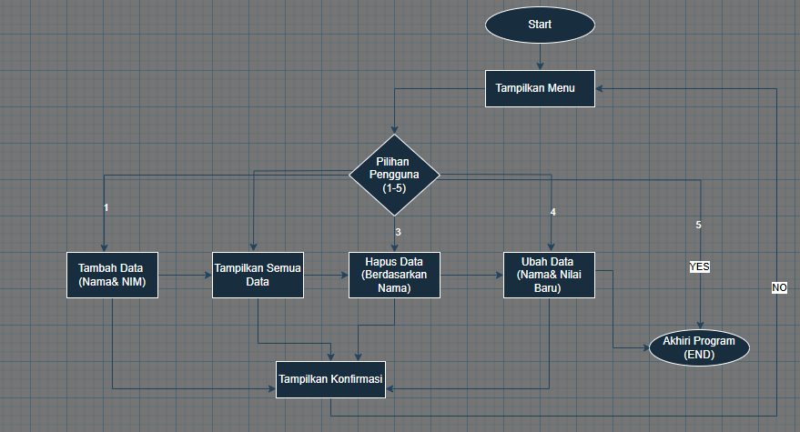
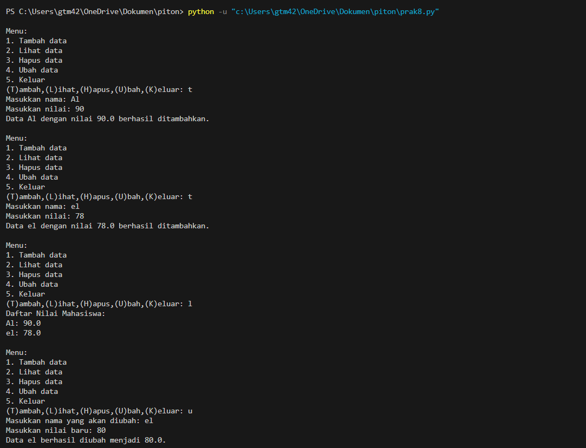
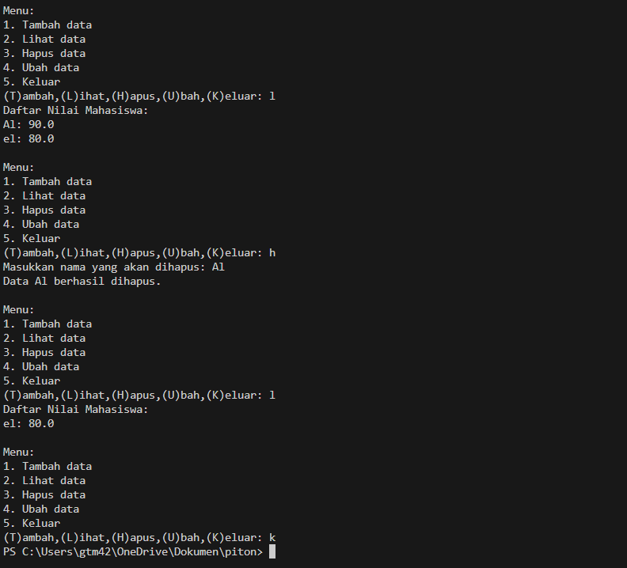
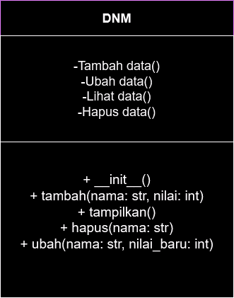

## Deskripsi Program Daftar Nilai Mahasiswa
Daftar Nilai Mahasiswa adalah sebuah program berbasis Python untuk mengelola data nilai mahasiswa. Program ini memungkinkan pengguna untuk menambah, menampilkan, menghapus, dan mengubah data nilai mahasiswa dengan mudah melalui antarmuka berbasis teks. Data disimpan dalam bentuk dictionary, sehingga pengelolaan data menjadi cepat dan efisien.

## Fitur program 
- Tambah Data: Menambahkan nama dan nilai mahasiswa ke dalam daftar.
- Tampilkan Data: Menampilkan daftar semua mahasiswa beserta nilainya.
- Hapus Data: Menghapus data mahasiswa berdasarkan nama.
- Ubah Data: Mengubah nilai mahasiswa tertentu.
- Exit Program: Keluar dari program.

## Flowchart 


# Kode Program 
```Python
class DNM:
    def __init__(self):
        self.data = {}

    def tambah(self, nama, nilai):
        self.data[nama] = nilai
        print(f"Data {nama} dengan nilai {nilai} berhasil ditambahkan.")

    def tampilkan(self):
        if not self.data:
            print("Belum ada data yang ditambahkan.")
        else:
            print("Daftar Nilai Mahasiswa:")
            for nama, nilai in self.data.items():
                print(f"{nama}: {nilai}")

    def hapus(self, nama):
        if nama in self.data:
            del self.data[nama]
            print(f"Data {nama} berhasil dihapus.")
        else:
            print(f"Data dengan nama {nama} tidak ditemukan.")

    def ubah(self, nama, nilai_baru):
        if nama in self.data:
            self.data[nama] = nilai_baru
            print(f"Data {nama} berhasil diubah menjadi {nilai_baru}.")
        else:
            print(f"Data dengan nama {nama} tidak ditemukan.")


# Contoh penggunaan program
if __name__ == "__main__":
    daftar_nilai = DNM()
    
    while True:
        print("\nMenu:")
        print("1. Tambah data")
        print("2. Lihat data")
        print("3. Hapus data")
        print("4. Ubah data")
        print("5. Keluar")
        
        pilihan = input("(T)ambah,(L)ihat,(H)apus,(U)bah,(K)eluar: ")
        
        if pilihan == "t":
            nama = input("Masukkan nama: ")
            try:
                 # Pastikan nilai adalah angka

                nilai = float(input("Masukkan nilai: ")) 
                daftar_nilai.tambah(nama, nilai)
            except ValueError:
                print("Nilai harus berupa angka.")
        elif pilihan == "l":
            daftar_nilai.tampilkan()
        elif pilihan == "h":
            nama = input("Masukkan nama yang akan dihapus: ")
            daftar_nilai.hapus(nama)
        elif pilihan == "u":
            nama = input("Masukkan nama yang akan diubah: ")
            try:
                 # Pastikan nilai baru adalah angka

                nilai_baru = float(input("Masukkan nilai baru: ")) 
                daftar_nilai.ubah(nama, nilai_baru)
            except ValueError:
                print("Nilai baru harus berupa angka.")
        elif pilihan == "k":
            break
        else:
            print("Tidak valid.")

```

## Output Program 



# Diagram Class 


# Cara Kerja Program 
1. Inisialisasi
- Program dimulai dengan membuat objek dari class DaftarNilaiMahasiswa.
- Data mahasiswa disimpan dalam dictionary kosong.
2. Tampilkan Menu
- Program menampilkan menu utama dengan opsi:
    - Tambah data
    - Tampilkan data
    - Hapus data
    - Ubah data
    - Keluar
3. Proses Berdasarkan Pilihan
- Tambah Data: Menambahkan nama dan nilai mahasiswa.
- Tampilkan Data: Menampilkan semua data mahasiswa.
- Hapus Data: Menghapus data mahasiswa berdasarkan nama.
- Ubah Data: Mengubah nilai mahasiswa tertentu.
- Keluar: Mengakhiri program.
4. Validasi Input
- Nilai mahasiswa diverifikasi sebagai angka (float).
- Program memberikan pesan error jika input tidak valid.
5. Sesi Berulang
- Program berjalan dalam loop hingga pengguna memilih "Keluar".